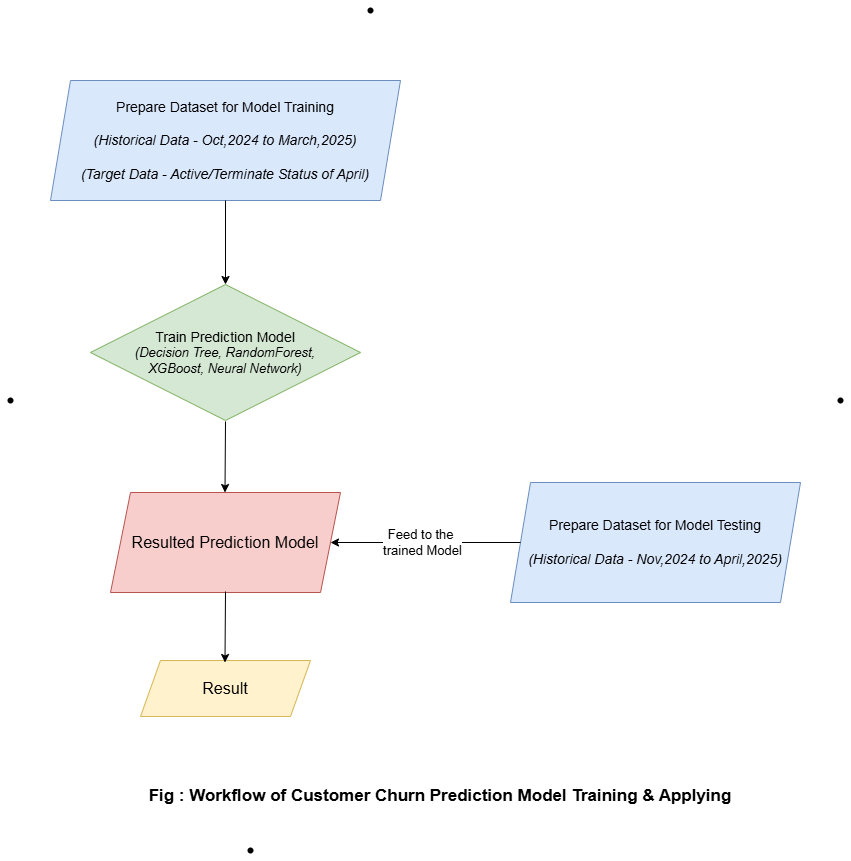

# 📊 Customer Churn Prediction Project  

## 📝 Project Overview  

This project focuses on building **customer churn prediction models** using three popular machine learning algorithms:  
- 🌳 **Decision Tree**  
- 🌲 **Random Forest**  
- ⚡ **XGBoost**  

The models are trained on **six months of historical ticketing data** (October 2024 – March 2025) to predict which customers are likely to remain **Active ✅** or **Terminate ❌** their services in **April 2025**.  

---

## 🔄 Workflow  

  

---

## 📂 Dataset Preparation  

### 📊 Training Dataset (October 2024 – March 2025)  
- 🧹 **Data Cleaning** → `oct_march_data_cleaning.ipynb`  
- ⚙️ **Data Preparation** → `oct_march_data_preparation.ipynb`  

➡️ Output: `oct_march_prepared_data.csv` (saved under `data/`)  

---

### 📊 Testing Dataset (November 2024 – April 2025)  
- 🧹 **Data Cleaning** → `nov_april_data_cleaning.ipynb`  
- ⚙️ **Data Preparation** → `nov_april_data_preparation.ipynb`  

➡️ Output: `nov_april_prepared_data.csv` (saved under `data/`)  

---

## 🤖 Model Training  

- 🌳 **Decision Tree** → `decision_tree.ipynb`  
- 🌲 **Random Forest** → `random_forest.ipynb`  
- ⚡ **XGBoost** → `xgboost.ipynb`  

📁 Trained models are saved in the `saved_model/` directory.  
📄 Training dataset used → `oct_march_prepared_data.csv`  

---

## 🧪 Model Testing  

We evaluate how well the models predict customer status (Active ✅ / Terminated ❌) for **May 2025**, using another six months of data (November 2024 – April 2025).  

🔍 Steps:  
1. Generate predictions for May 2025.  
2. Compare results with the **actual customer status** from May (available in `actual_may_terminated_active_data/`).  

📂 Implementation Notebooks:  
- 🌳 `decision_tree_model_implementation.ipynb`  
- 🌲 `random_forest_model_implementation.ipynb`  
- ⚡ `xgboost_model_implementation.ipynb`  

---

## 🙏 Acknowledgement  

⚠️ The **original dataset** is excluded from this repository due to **company privacy restrictions**.  

#### 👉 "A detailed comparison of the three models' performance is provided in the rt_model_result.xlsx file."
---
